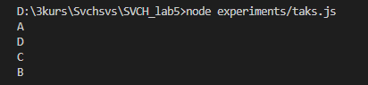
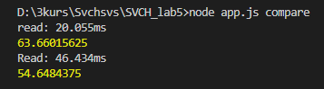
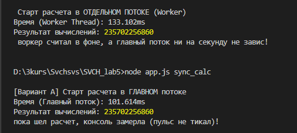

# Лабораторная работа № 5: Node.js (CLI, Файловая система, Потоки и Worker Threads)

## Предметная область и структура проекта

Приложение представляет собой консольную утилиту (CLI) для управления базой данных товаров салона красоты.
Для хранения используется двухуровневая архитектура:

- `data/index.json` — лёгкий индексный файл (оглавление), хранящий `id`, `name` и ссылку на файл `filepath` для быстрого поиска и вывода списка.
- `data/products/` — каталог, где каждая запись хранится в отдельном JSON-файле (`1.json`, `2.json` и т.д.) с полным описанием товара.

### Команды запуска:

- `node app.js list` — вывод списка всех товаров из индекса
- `node app.js read <id>` — чтение полной информации о товаре
- `node app.js create <id> <name> <price> <desc> <cat> <rating>` — создание нового товара
- `node app.js delete <id>` — удаление товара и очистка индекса
- `node app.js update <id>` — интерактивное обновление полей через `stdin`
- `node app.js rename <id>` — переименование файла и обновление ссылки в индексе
- `node app.js search` — интерактивный поиск по параметру через `stdin`
- `node app.js backup ./data ./backup` — резервное копирование каталога данных
- `node app.js transform` — потоковое чтение, трансформация и запись большого файла
- `node app.js compare` — сравнение чтения через `fs.readFile` и `Stream`
- `node app.js sync_calc` / `node app.js calc-worker` — сравнение вычислений в главном потоке и Worker Thread

---

## Ответы на вопросы (Раздел 1: CLI)

1. **Что хранится в `process.argv` и почему значения имеют тип `string`?**
   В `process.argv` хранится массив аргументов командной строки (где `[0]` — путь к Node.js, `[1]` — путь к файлу скрипта, а с `[2]` начинаются пользовательские команды). Все значения имеют тип `string`, так как операционная система передаёт введённую в терминал команду как единый текстовый поток символов без привязки к типам данных JS.
2. **Чем аргументы командной строки отличаются от `stdin`?**
   `process.argv` передаются один раз до момента запуска программы, а `process.stdin` (и модуль `readline`) позволяет вести интерактивный диалог и принимать данные от пользователя прямо во время работы программы.
3. **Что делает программа при недостаточном количестве аргументов?**
   Программа перехватывает отсутствие аргумента (проверка `!process.argv[3]`), не выполняет опасную операцию, выводит понятное сообщение с подсказкой пользователю и штатно завершает работу.

---

## Задание № 3: Асинхронность и Event Loop

**Результат вывода:** `A / D / C / B`

Такой порядок означает приоритетность выполнения задач:

- **Синхронный код (`A` и `D`)** имеет наивысший приоритет и выполняется сразу в стеке вызовов.
- **Асинхронный код** делится на `microtasks` и `macrotasks`:
  - **Microtasks (`C`)** имеет высокий приоритет — в него входят все инструменты обработки `Promise`. Он выполняется сразу после того, как полностью завершится синхронный код.
  - **Macrotasks (`B`)** — такой код, который вызывает колбэк (например, в нашем случае `setTimeout`), будет выполняться с обычной приоритетностью, так как колбэк `setTimeout` попадает в очередь макротасок (фаза Timers в Event Loop), и Node.js откладывает его вызов до тех пор, пока полностью не завершится синхронный код и не выполнятся все микротаски.
    К macrotasks также относятся сетевые запросы (`fetch`): они используют поток ядра операционной системы, чтобы она отправила сетевой пакет в буфер сетевой карты, далее само ядро ОС свободно для других задач, но когда данные записаны в оперативку, сетевая карта отправляет электрический заряд ядру ОС (аппаратное прерывание) — так ядро понимает, что данные пришли, и возвращает колбэк движку. Также сюда входит работа с файлами и криптография — это обрабатывает один из фоновых потоков, создаваемых библиотекой `libuv`.

---

## Задание № 4: Потоки (Streams)

По времени `Stream` выполнялся дольше, но зато **сэкономил ~10 МБ памяти** (54.6 МБ против 63.6 МБ). Более долгое выполнение объясняется тем, что на небольших объёмах затратно нарезать данные на чанки, создавать события, записывать в оперативку и очищать буфер. Зато на больших объёмах обычное чтение `fs.readFile` было бы небезопасным: файл мог бы весить гигабайты, и тогда возникла бы фатальная ошибка переполнения памяти (`Out of Memory`).

**Ответы на вопросы по потокам:**

- **Что такое `chunk`?** Это небольшой фрагмент данных (порция байтов в буфере, по умолчанию 64 КБ), на которые поток нарезает файл при чтении.
- **Как связаны `Readable`, `Transform` и `Writable`?** `Readable` считывает чанки из источника, `Transform` принимает их и изменяет на лету (например, переводит текст в верхний регистр), а `Writable` записывает готовые чанки в целевой файл.
- **Что делает `pipe()` и почему он удобен?** Метод `pipe()` соединяет потоки в единый конвейер (трубопровод). Он удобен тем, что автоматически управляет скоростью потока (контролирует переполнение буфера — _backpressure_) и сам закрывает потоки по окончании чтения.

---

## Задание № 5: Worker Threads

На отдельный поток (`Worker Thread`) ушло чуть больше времени (133 мс против 101 мс), так как системе необходимо было выделить отдельное ядро и поток, инициализировать окружение, а также при расчёте упаковать результат, отправить его через оперативку из соседнего ядра и распаковать.
Но **Worker Threads необходим не для ускорения мелких задач, а для разгрузки основного потока**, чтобы работа шла параллельно и главный поток не зависал при тяжёлых математических вычислениях (CPU-bound задачах).

- **Отличие от обычной асинхронной операции с файлом:** Чтение файла — это задача ввода-вывода (I/O), она ждёт ответа от диска и не грузит процессор. А сложная математика грузит само ядро процессора на 100%, поэтому обычная асинхронность (`Promise`) тут не спасёт — нужен отдельный поток `Worker Thread`.
- **Отличие `child_process.spawn` от `Worker Thread`:** `spawn` запускает совершенно отдельную тяжелую программу (процесс ОС) со своей изолированной памятью, а `Worker Thread` создаёт легковесный поток внутри текущего процесса Node.js и может использовать общую память.

---

## Задание № 6: Обработанные негативные сценарии (Ошибки)

1. **Передача недостаточного количества аргументов** (`node app.js delete` без ID) — программа выводит подсказку и не падает.
2. **Чтение несуществующей записи** (`node app.js read 999`) — проверка через индекс сообщает, что товар с таким ID не найден.
3. **Удаление несуществующей записи** (`node app.js delete 999`) — выводится сообщение об отсутствии ID без вызова системного сбоя `unlink`.
4. **Создание записи с уже существующим ID** (`node app.js create 1 ...`) — проверка блокирует создание дубликата и просит ввести уникальный идентификатор.
5. **Ошибка копирования / некорректный путь бэкапа** — перехватывается блоком `try...catch` с выводом сообщения об ошибке.
